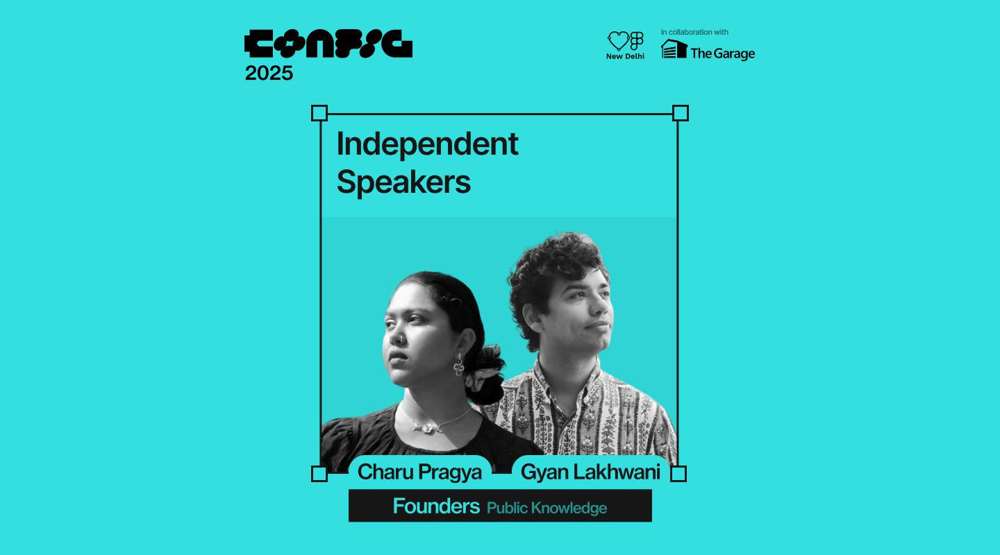
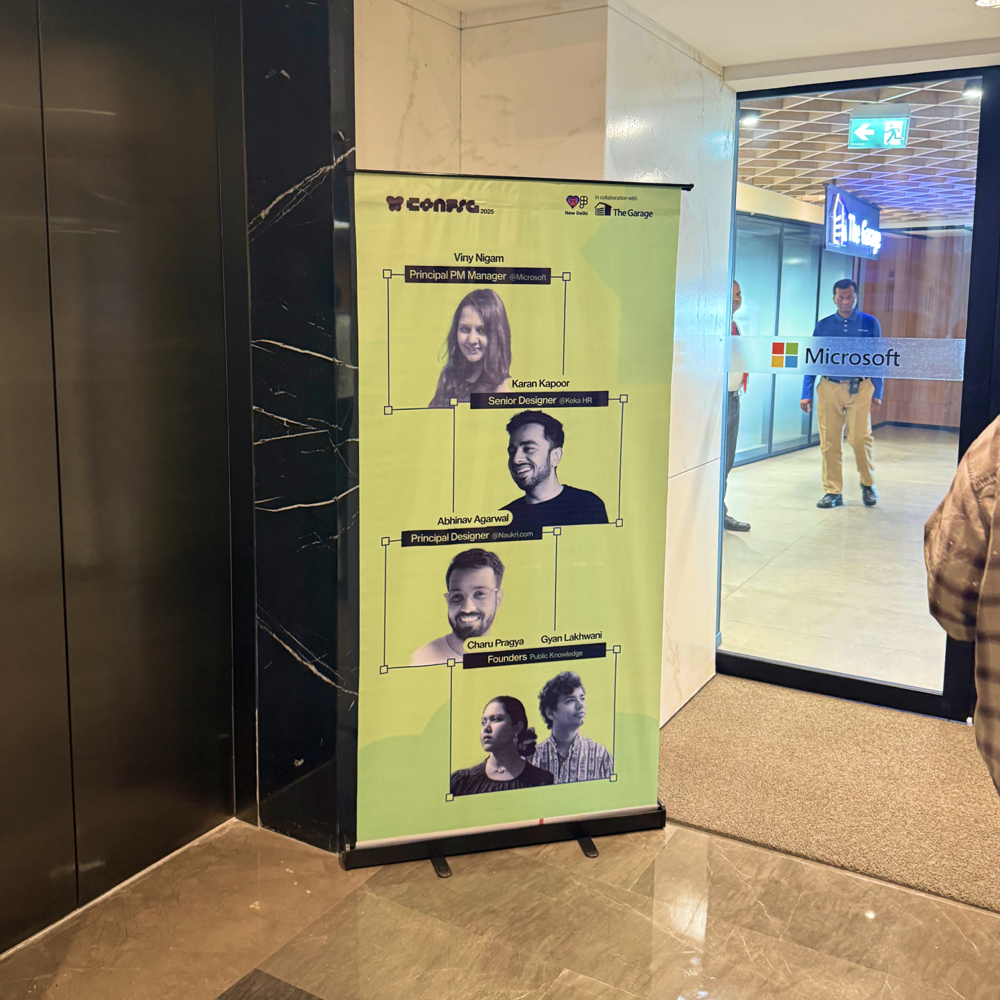
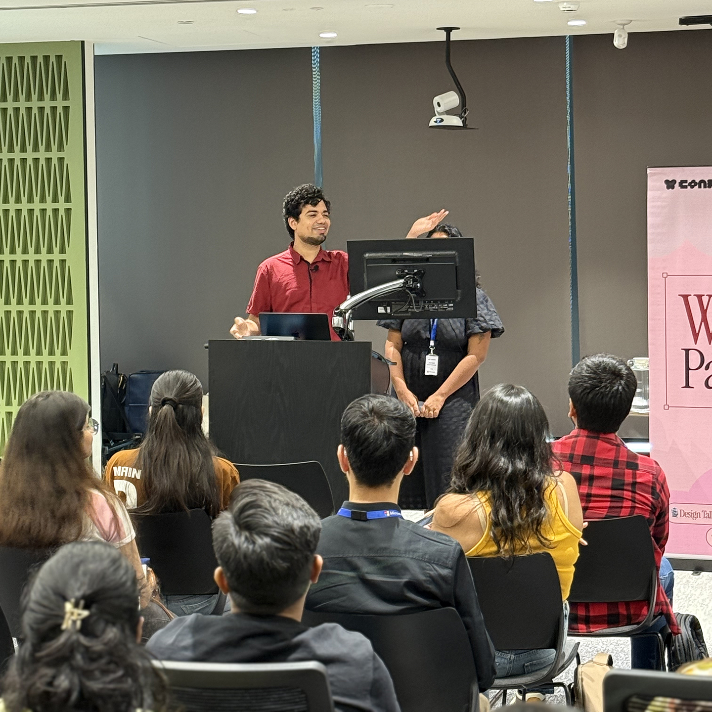
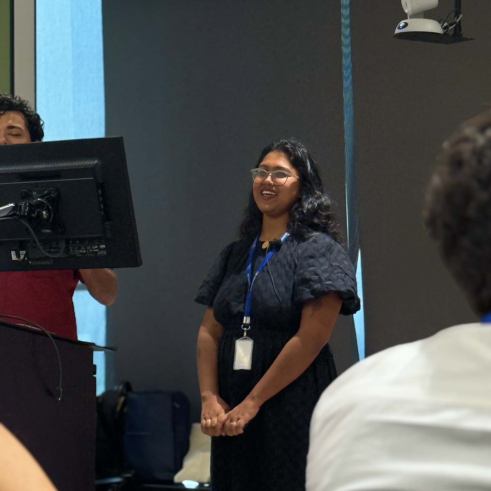

# About

The Delhi chapter of Friends of Figma organised a Config 2025 Watch Party at the Microsoft office in Noida. Charu and I presented a talk on what we felt portfolios should do, and our process for designing our own portfolio at [publicknowledge.co](https://www.publicknowledge.co). Along the way we looked at a number of other portfolio sites from early, mid and late career designers, as well as some other design studios.

## Being Back

It was nice to be back at Microsoft where I worked for four and a half years, this time as a speaker. The free vending machine cola is unfortunately only for employees, but my friends were kind enough to sneak me one anyway.

