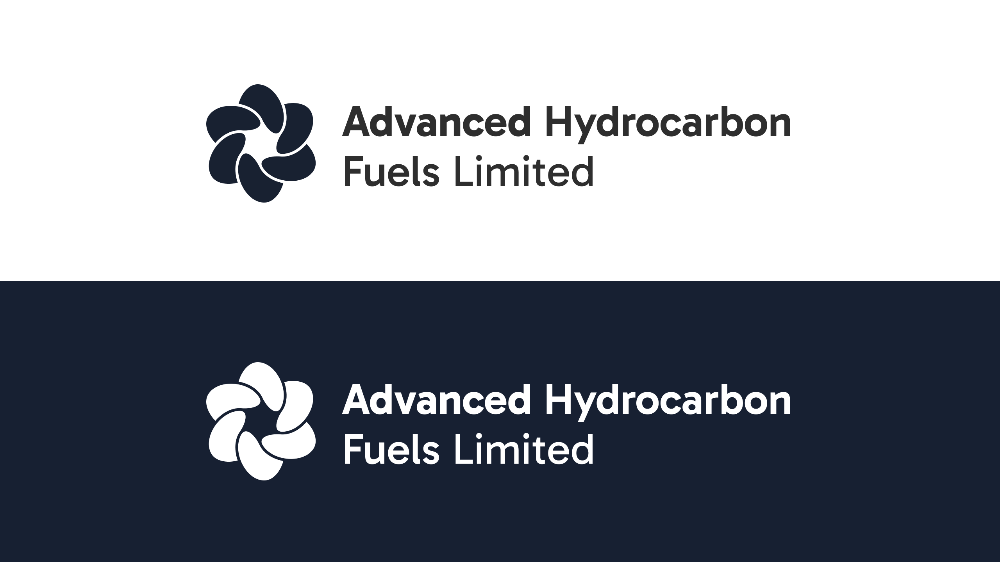

Advanced Hydrocarbon Fuels Limited came to us to help them communicate their patented process to turn plastic into fuel.

## Turning Plastic into Fuel

**Designing clarity for a complex chemical breakthrough**

**Client:** Advanced Hydrocarbon Fuels Limited

**Service:** Brand strategy, visual design, information design

**Sector:** Clean energy, Sustainability, Industrial innovation

### The Challenge

Advanced Hydrocarbon Fuels Limited (AHF) developed a patented chemical process that converts plastic waste into clean-burning fuel. The science was sound, the innovation promising—but the messaging? Dense, technical, and inaccessible to stakeholders outside the lab.

They needed help translating their breakthrough into a story investors, policymakers, and the public could understand. One that felt as compelling as the science behind it.

### Our Approach

We started by learning the process ourselves. Through deep-dive workshops with AHF’s engineers and scientists, we mapped out the lifecycle of their proprietary technology—from raw plastic to refined fuel.

We then distilled the complexity into a set of core narratives:

- **The Environmental Story**: Turning a global waste problem into a renewable energy solution.

- **The Business Opportunity**: A scalable model with global market potential.

- **The Scientific Edge**: A process that is efficient, patented, and already in pilot deployment.

Each story thread was supported by clear infographics, iconography, and a visual identity rooted in industrial precision and environmental hope. The goal wasn’t to oversimplify—but to make the extraordinary understandable.

### The Output

- A presentation deck used for investor pitches and government partnerships

- Explainer diagrams of the patented conversion process

- Visual identity system for the technology

- Web content structure and copy tone guidelines

- Technical illustrations for whitepapers and regulatory submissions

### The Impact

AHF’s updated pitch deck helped secure interest from two climate-focused venture capital firms. The visual system is now used across the company’s investor relations, partner onboarding, and regulatory presentations.

Most importantly, the work helped position AHF not just as inventors of a process—but as leaders of a movement toward circular fuel systems.
