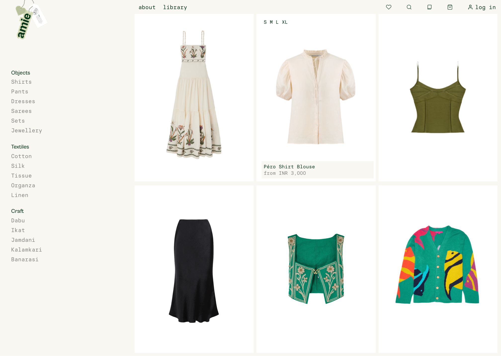
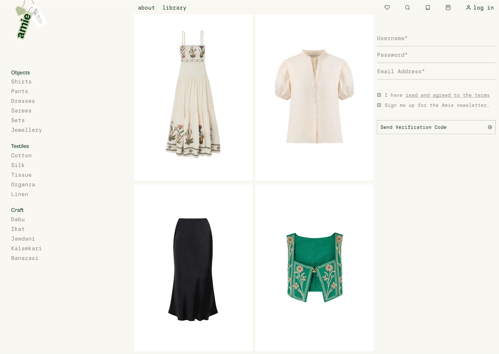
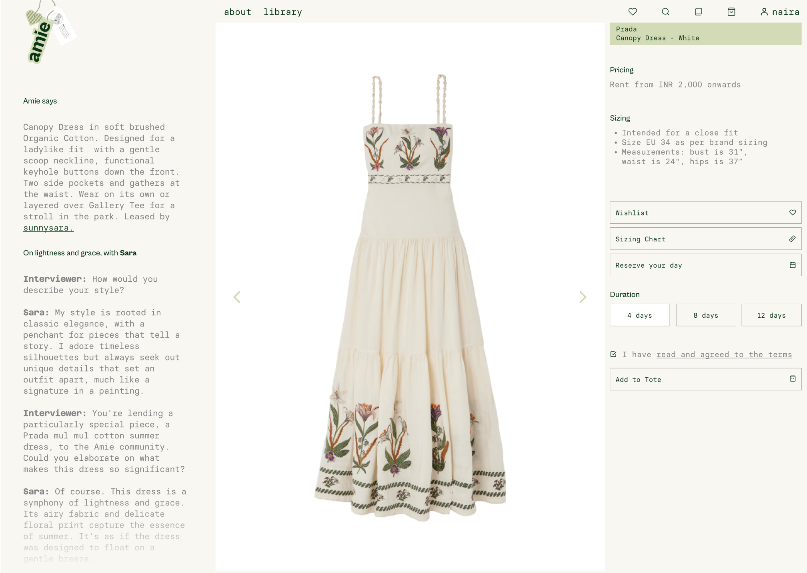
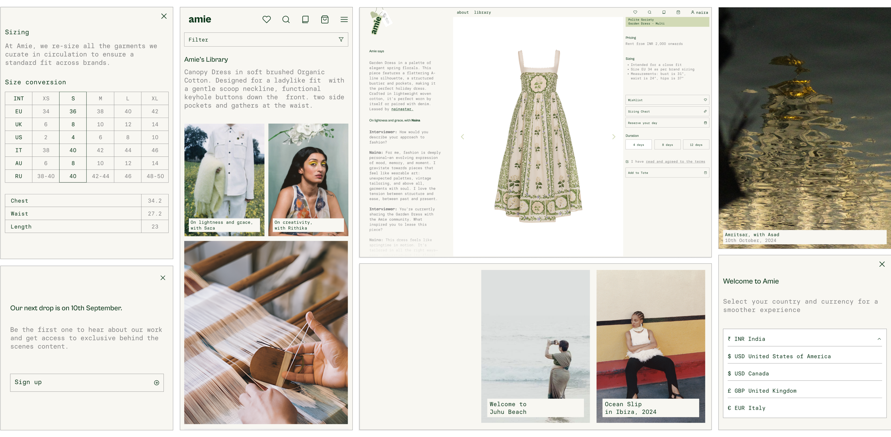
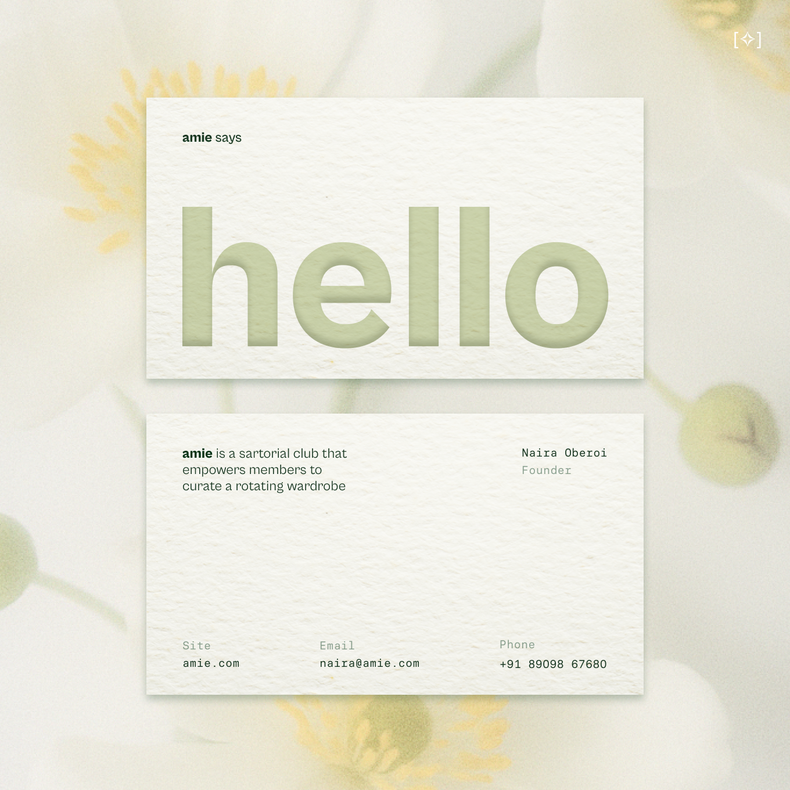
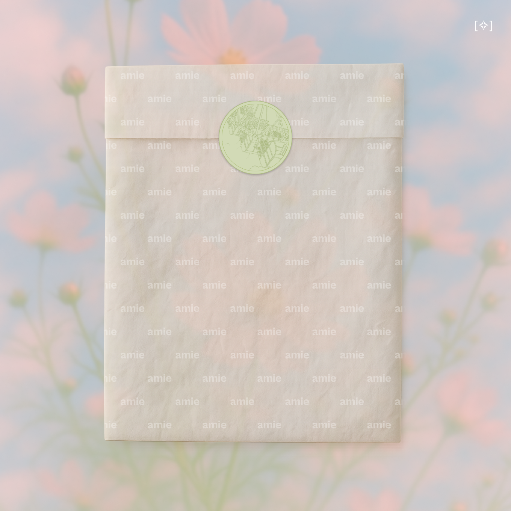
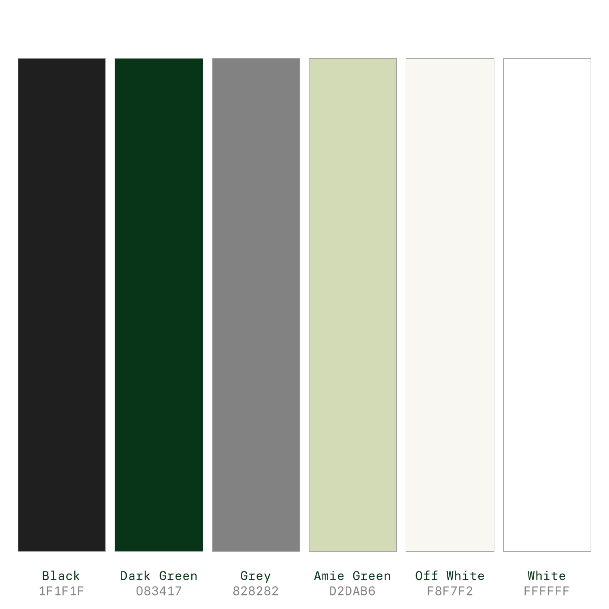
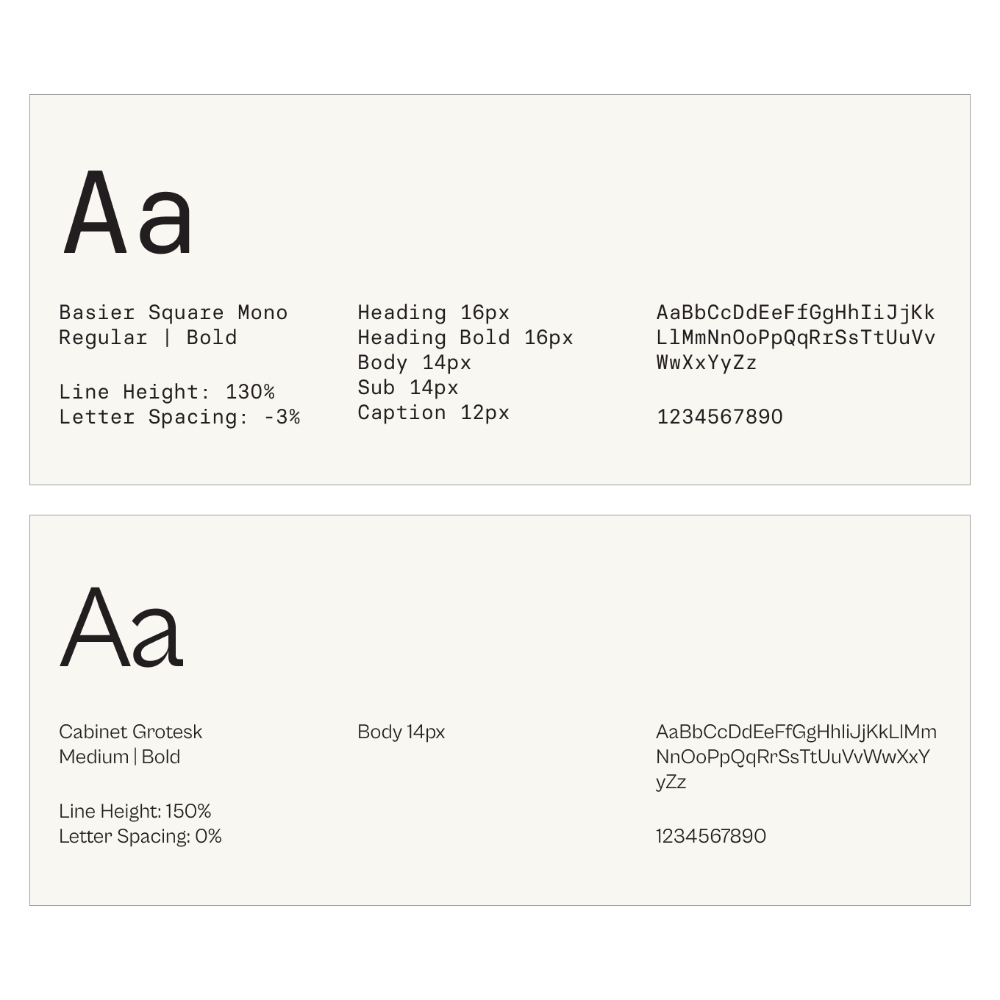

# Heading

Some text about amie.

# Heading 1

Some text

    
Charu and Namita didn’t just understand my vision; they elevated it, delivering a site design more thoughtful and beautiful than I could have imagined. I loved it instantly.

    
Naira Oberoi
    
Founder of Amie

    

