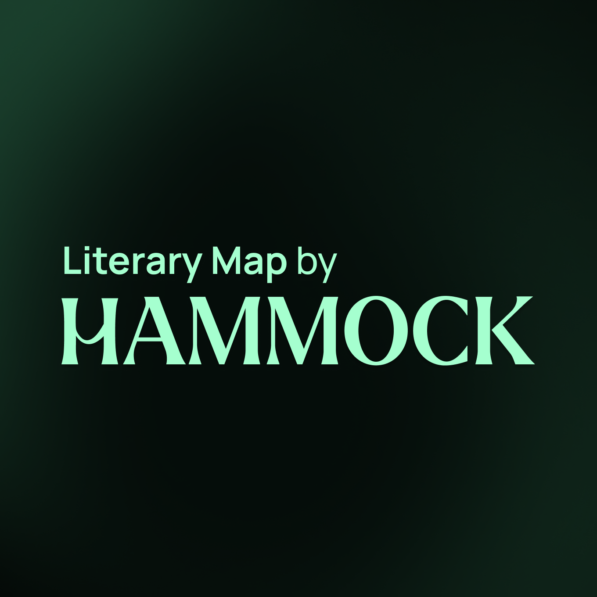
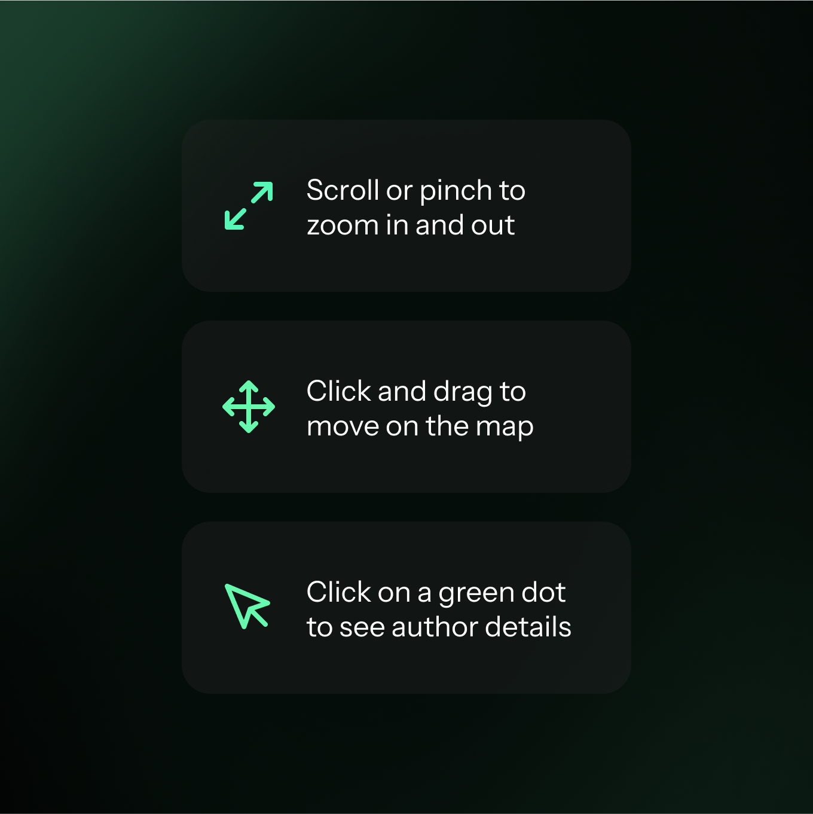
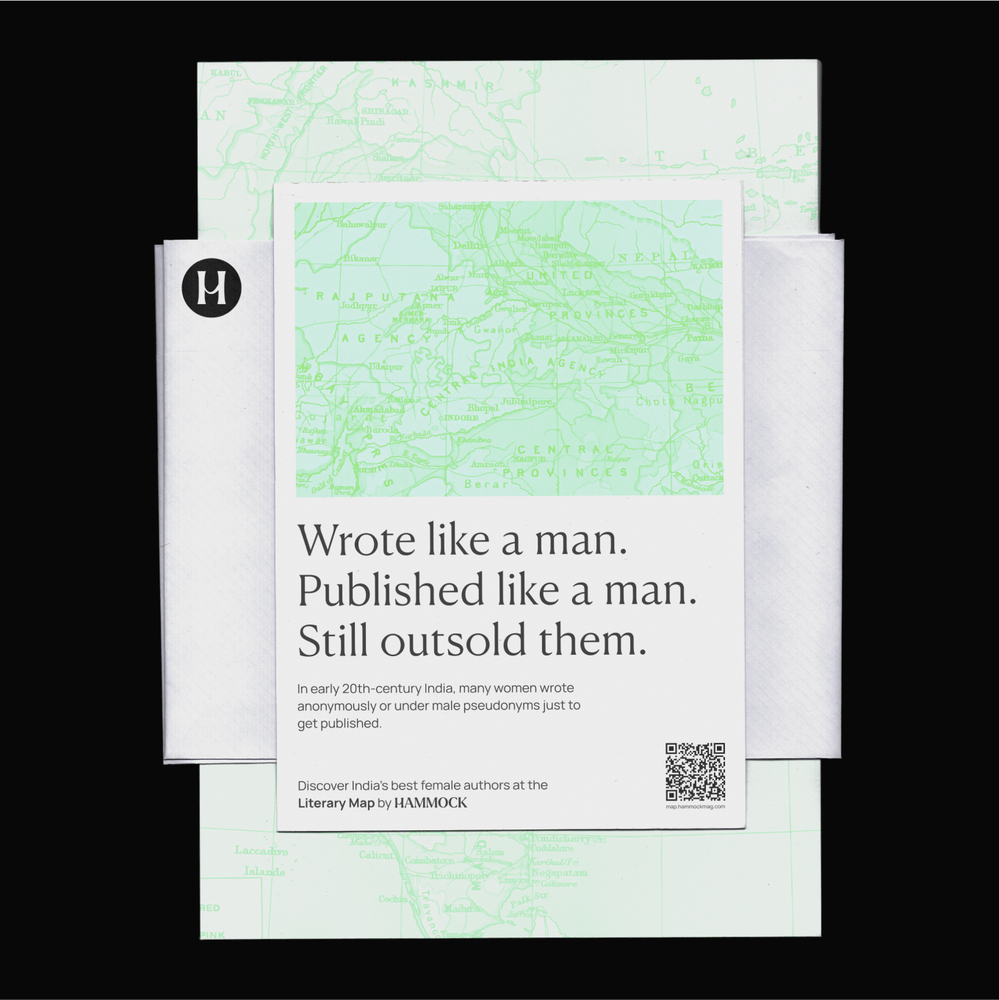
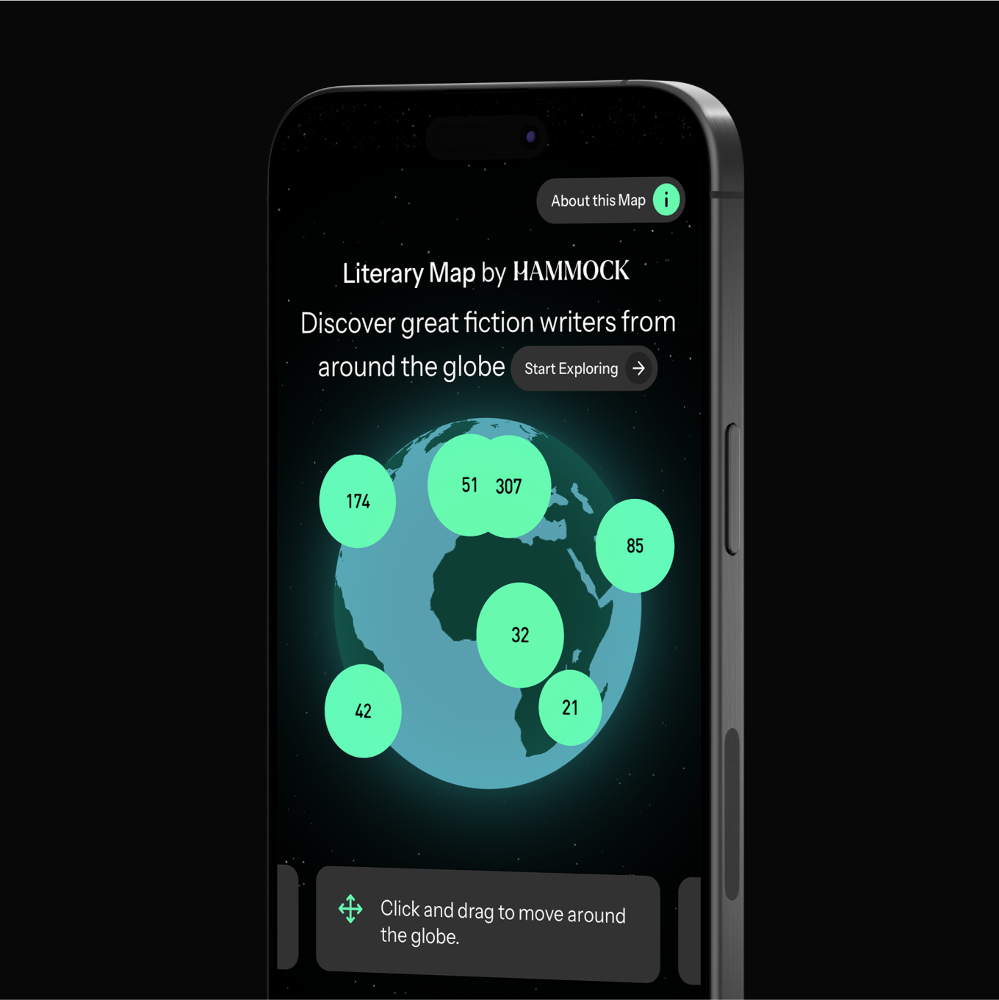
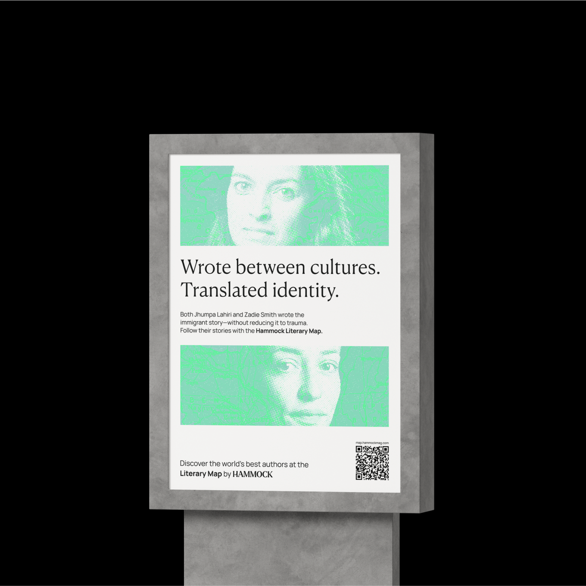

# The Brief

We partnered with Hammock Mag to bring their editorial archive to life through an interactive map that visualizes the geographical journey of authors featured in their publication. The goal was to create a discovery tool that merged design, development, and content strategy in a way that honored the magazine’s thoughtful tone and experimental spirit.

# Tech Stack

The tool was built as a responsive web app with a clean, immersive interface. We worked with GeoJSON datasets and a custom CMS workflow that allowed Hammock’s editors to tag stories with meaningful metadata—including author location, themes, and timeframes. Users can explore these narratives spatially, uncovering patterns across regions and literary movements.

# Key Design Considerations

From a design perspective, we emphasized minimalism and legibility—leveraging generous white space, serif typography, and organic animations. Technically, we optimized for fast load times and mobile browsing while preserving the editorial richness of the original stories.

# Impact

The result is a map that functions not just as a digital archive, but as a living essay—expanding how literary work can be organized, read, and revisited.

